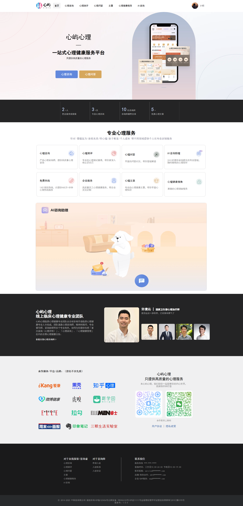
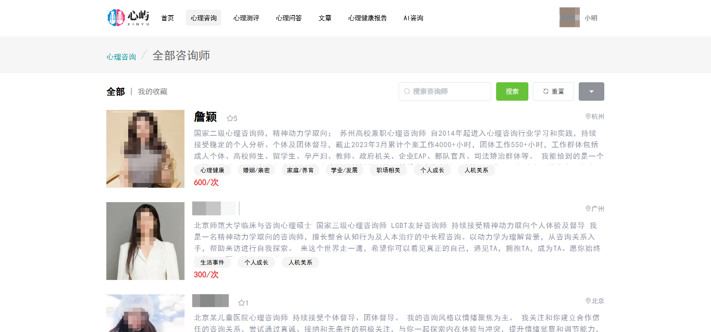
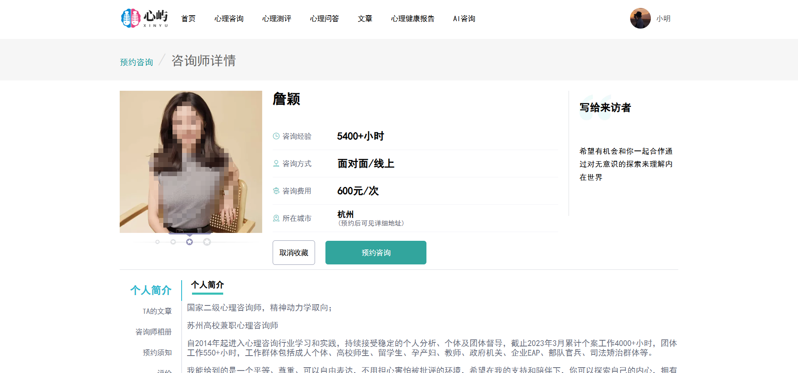
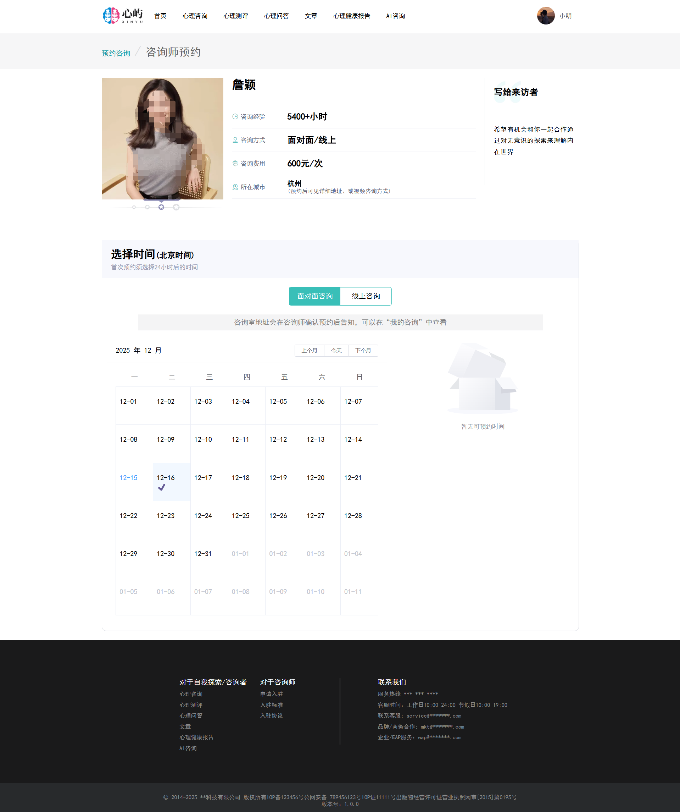
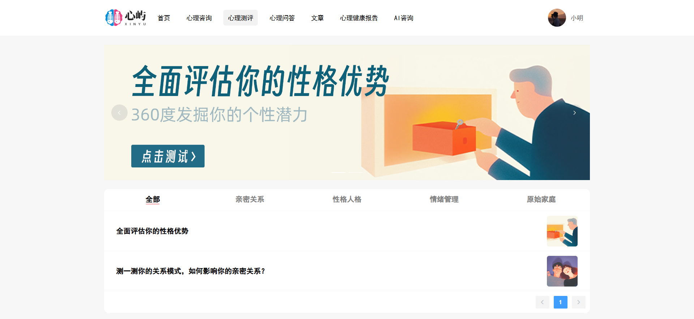
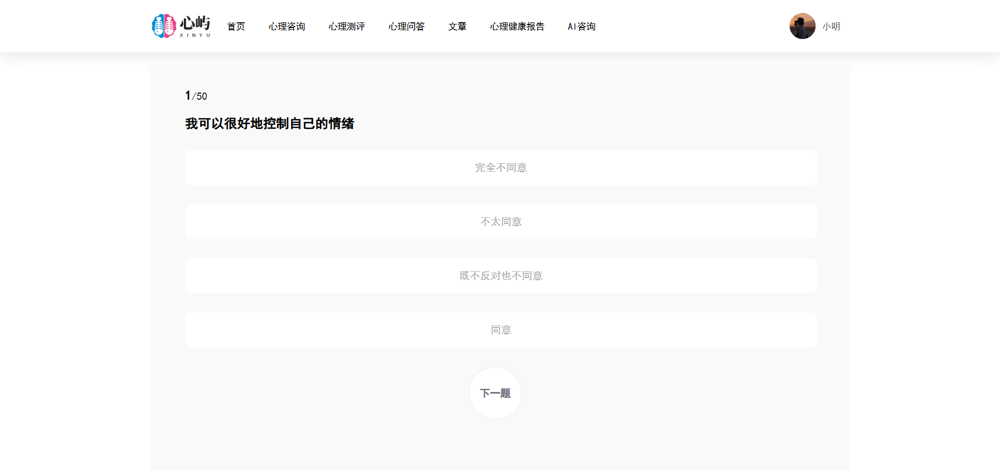
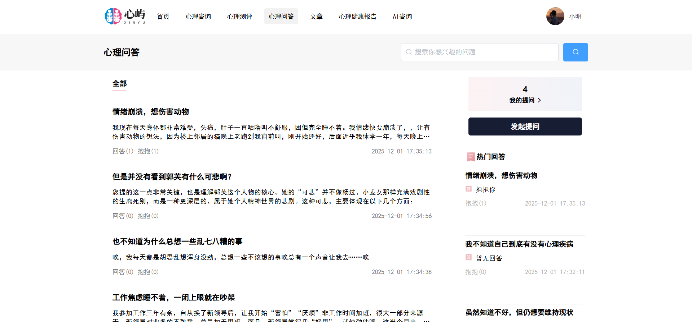
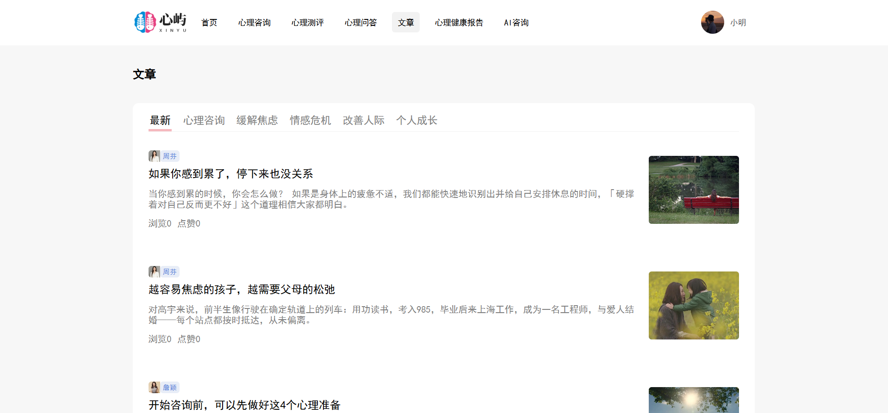
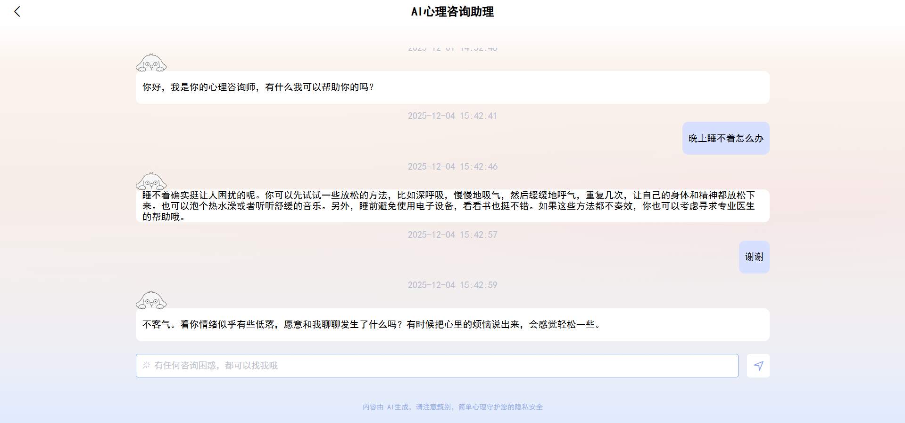
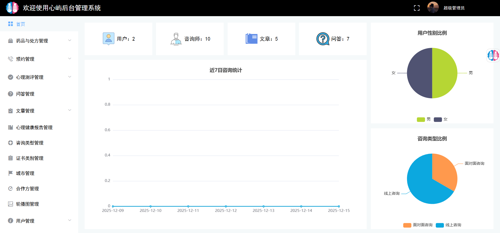

# SpringBoot+Vue的心理咨询与预约系统

 **获取完整资料**  :tw-2795:  :tw-1f1f6:  :tw-1f1f6:  :tw-31-20e3:  :tw-37-20e3:  :tw-36-20e3:  :tw-30-20e3:  :tw-32-20e3:  :tw-37-20e3:  :tw-32-20e3:  :tw-36-20e3:  :tw-32-20e3:  :tw-37-20e3: 

### 功能介绍：

 **系统分为三个角色：用户、管理员、咨询师，各个角色的功能如下所示：** 

 **用户：** 登录、注册、忘记密码、首页、预约咨询、在线咨询、心理测评、心理问答、评论、文章、心理健康报告、AI咨询、个人中心、我的预约、我的订单、我的咨询、我的测试、我的问答等功能

 **咨询师：** ：登录、首页、药品管理、处方管理、预约记录管理、预约时间段管理、咨询档案、测评管理、文章管理、个人简介、个人中心等功能

 **管理员：** 登录、首页、药品类型管理、处方管理、预约记录、测评类型管理、测评管理、问答管理、文章管理、心理健康报告管理、咨询类型管理、咨询类别管理、城市管理、合作方管理、轮播图管理、用户管理、咨询师管理、个人中心、系统设置等功能

### 系统截图：

### 开发工具和框架：

框架：SpiringBoot,Vue
工具：Idea,VsCode,Navicat
数据库：MySQL,redis

 **获取资料：** 

 **获取完整资料**  :tw-2795:  :tw-1f1f6:  :tw-1f1f6:  :tw-31-20e3:  :tw-37-20e3:  :tw-36-20e3:  :tw-30-20e3:  :tw-32-20e3:  :tw-37-20e3:  :tw-32-20e3:  :tw-36-20e3:  :tw-32-20e3:  :tw-37-20e3: 